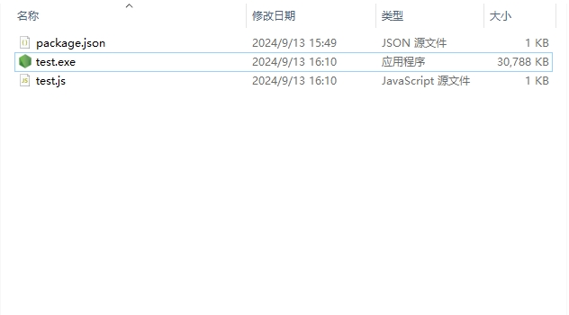

# 一键批量运行前端项目

#### 背景

工作中每次都需要给不同项目运行服务有给测试的、有给后端的、还有自己的稳定版分支，开发分支，这些都需要启动服务，然而每一次进行重复的操作然我觉得这正是可以使用工具偷懒的；所以我突发奇想，
写了一个 js 文件,如下：

```javascript
const { exec } = require("child_process")
const pathObj = {
  670: "C:\\Users\\adminpvc\\Documents\\plm6-OA",
  669: "C:\\Users\\adminpvc\\Desktop\\corporation\\plm6-finance-basic",
  668: "C:\\Users\\adminpvc\\Desktop\\corporation\\plm6-finance-basic-dispose",
  671: "C:\\Users\\adminpvc\\Documents\\plm6-next",
}

Object.keys(pathObj).forEach((key) => {
  exec(
    `yarn dev --port ${key}`,
    { cwd: pathObj[key] },
    (error, stdout, stderr) => {
      if (error) {
        console.error(`执行命令时出错: ${error.message}`)
        return
      }
      if (stderr) {
        console.error(`命令标准错误输出: ${stderr}`)
        return
      }
      console.log(`命令标准输出: ${stdout}`)
    },
  )
})
```

注意：

> 这里 pathObj 的键和值修改成自己想设置的端口和项目文件路径即可。

但是现在又有一个问题，我该怎么双击这个文件执行呢，难道还得手动在命令行用 node 去执行一下这个文件吗？

这可不行，于是我就搜索看有没有什么工具能够让 js 文件直接在 windows 桌面双击运行，于是我找到一个不错的第三方包: **pkg**

简单说明一下，它的作用就是可以将指定文件打包成目标系统可直接执行的文件

---

全局安装

```shell
npm install -g pkg
```

生成 package.json

```shell
npm init -y
```

接着再去想要打包的文件的路径下，执行如下命令

```shell
pkg ./<你的文件>.js --targets win
```

就会再当前目录下生成一个 exe 程序



当然也可以去自定程序的图标，这就需要去 package.json 里面去修改了，例如：

```json
{
  "name": "myapp",
  "version": "1.0.0",
  "pkg": {
    "targets": ["node14-win-x64"],
    "assets": [
      "assets/**/*" // 包含 assets 文件夹中的所有文件
    ],
    "icon": "icon.ico" // 指定图标文件
  }
}
```

这样就大功告成了。
